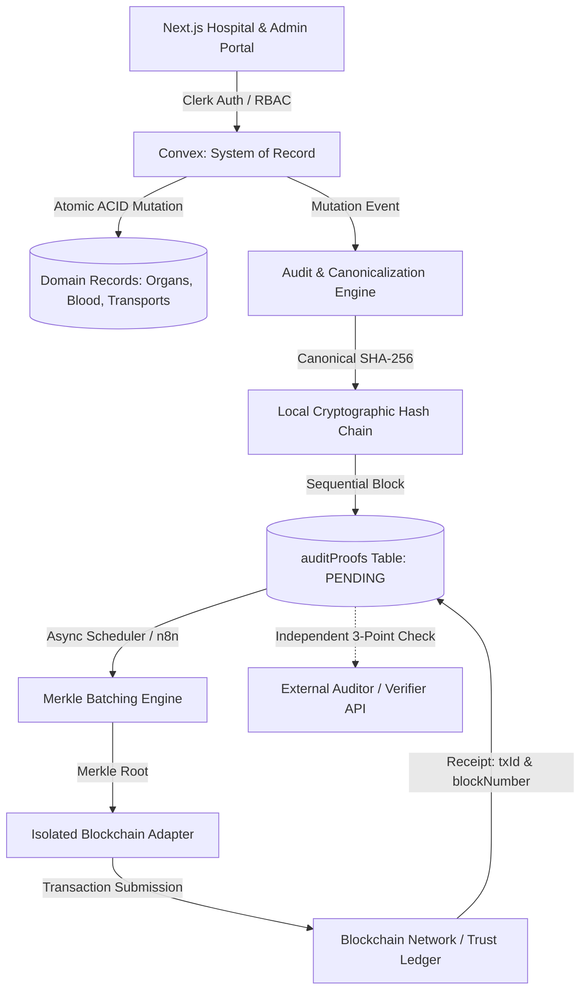

# VeinLink — Blockchain Trust, Provenance & Architecture Specification

## 1. Architectural Purpose & Boundaries

Blockchain in VeinLink acts exclusively as an **external cryptographic trust and integrity anchor**, not as a healthcare database or clinical execution engine.

### Strict Responsibility Separation
```text
DATA
Lives in Convex (System of Record, clinical tables, encrypted patient files).

DECISION
Remains under VeinLink domain policies and authorized human coordinators.

PROOF
Lives on the Blockchain / Trust Ledger (SHA-256 hashes, Merkle roots, block numbers, transaction receipts).
```

### Invariants:
- **Blockchain $\neq$ Database**: Healthcare state, waitlist priorities, and inventory remain in Convex.
- **Blockchain $\neq$ Clinical Engine**: Matching rules and clinical constraints are never evaluated inside smart contracts.
- **Blockchain $\neq$ Allocation Engine**: Organ allocation requires human approval and policy validation in Convex.
- **Zero-Block Guarantee**: All core healthcare mutations complete with zero latency dependency on blockchain confirmations. If the blockchain network is unreachable, Convex operations succeed uninterrupted and audit proofs remain in `PENDING` status for asynchronous background anchoring.
- **Zero-PHI On-Chain**: Patient names, donor phone numbers, blood test results, and clinical notes are **never** transmitted or written to the blockchain.

---

## 2. Target Architecture



---

## 3. Blockchain Provider Abstraction

Core healthcare logic interacts with blockchain networks strictly through the `BlockchainProvider` interface:

```typescript
export interface BlockchainProvider {
  networkName: string;
  anchor(payload: AnchorPayload): Promise<AnchorResult>;
  verify(payload: VerifyPayload): Promise<VerificationResult>;
}
```

### Supported Providers:
1. **`SimulatedLedgerProvider`**:
   - High-throughput, deterministic in-memory/persistent cryptographic ledger.
   - Generates realistic transaction IDs (`0x...`), block numbers, and confirmation timestamps.
   - Active by default for local development, hackathon demos, and zero-downtime fallback.
2. **`EVMContractProvider`**:
   - Extensible JSON-RPC provider active when `BLOCKCHAIN_ENABLED=true` pointing to Ethereum Sepolia or Polygon networks.
   - Submits Merkle roots to an on-chain anchoring contract.
