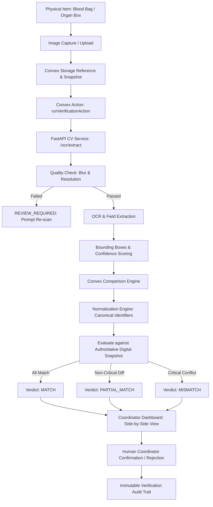

# VeinLink — Computer Vision & OCR Verification Architecture

## 1. System Vision & Safety Boundary

The Computer Vision and OCR Verification subsystem connects **physical-world identifiers and documents** with VeinLink's digital database records.

### Critical Safety Boundary
- Computer Vision acts exclusively as a **Verification Assistant** and **never** as a clinical decision system.
- It does **NOT** determine medical eligibility, organ suitability, disease status, or clinical safety.
- **Anti-Auto-Modification Invariant**: Probabilistic OCR extractions will **never** automatically overwrite or alter authoritative medical domain records in Convex. Consequential discrepancies must be resolved and confirmed by authorized human coordinators.

---

## 2. Target Architecture

---

## 3. Modular Domain Components

### 1. Image Quality Checking
Before text extraction, images are evaluated for blurriness, resolution, and readability. Unusable images are flagged with `is_usable: false` and routed to `REVIEW_REQUIRED` without guessing missing data.

### 2. Normalization Engine (`normalizationEngine.ts`)
Converts noisy, real-world text into canonical domain tokens:
- **Blood Groups**: `"A POSITIVE"` $\to$ `"A+"`, `"O NEG"` $\to$ `"O-"`.
- **Identifiers**: `"ORG - 1042 "` $\to$ `"ORG-1042"`.
- **Organ Types**: `"KIDNEY (LEFT)"` $\to$ `"KIDNEY"`.

### 3. Comparison Engine (`comparisonEngine.ts`)
Deterministically compares extracted physical values against authoritative Convex snapshots:
- Mismatches on primary identifiers, blood groups, or organ types are classified as **`CRITICAL`** severity, triggering a `MISMATCH` verdict.
- Non-critical variances (e.g. facility formatting) are classified as **`WARNING`**, producing a `PARTIAL_MATCH` verdict.
- Low OCR confidence ($< 0.65$) routes the request to **`REVIEW_REQUIRED`**.

### 4. FastAPI Boundary & Resilient Fallback
Inference runs through FastAPI endpoints (`/ocr/extract` and `/vision/verify-label`). If the ML backend is temporarily unreachable, the system automatically falls back to a deterministic parser without crashing the workflow.
