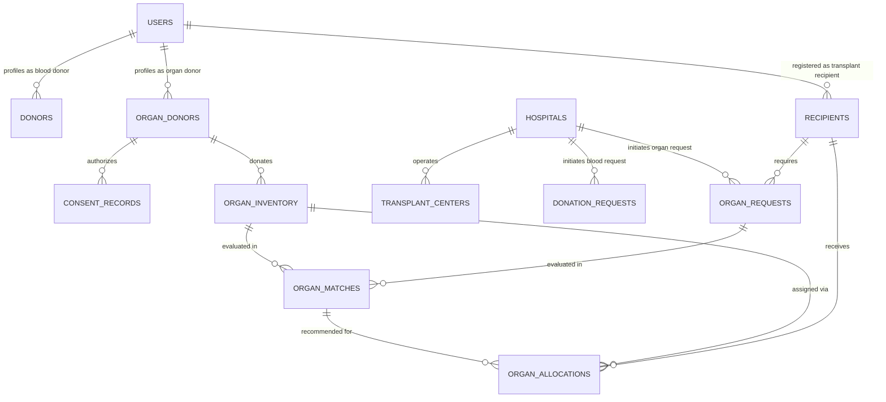

# VeinLink — Dual-Domain Architecture Specification

## 1. Architectural Vision

**VeinLink** is an intelligent, event-driven healthcare network managing two distinct, life-critical logistical pipelines:

```text
                                NETWORK (VeinLink)
                                         │
                   ┌─────────────────────┴─────────────────────┐
                   │                                           │
             BLOOD NETWORK                               ORGAN NETWORK
                   │                                           │
          ┌────────┼────────┐                         ┌────────┼────────┐
          │        │        │                         │        │        │
        Donors  Requests Inventory                  Donors  Requests Inventory
          │        │        │                         │        │        │
          └────────┼────────┘                         │     Recipients  │
                   │                                  │        │        │
               Matching                               └────────┼────────┘
                   │                                           │
              Reservation                                  Matching (Advisory)
                                                               │
                                                          Allocation (Authorized)
                                                               │
                                                        Human Coordinator Approval
```

---

## 2. Principle: Shared Infrastructure vs Isolated Domains

VeinLink enforces **controlled reuse rather than forced abstraction**. Universal abstractions (such as `UniversalDonor` or `UniversalRequest`) are strictly avoided because blood units and human organs operate under fundamentally different clinical, ethical, legal, and operational rules.

### Shared Infrastructure Layer
- **Identity & Authentication**: Clerk Authentication mapped into Convex `users`.
- **Organizations & Facilities**: `hospitals` and `transplantCenters` sharing geo-location coordinates (`lat`, `lng`, `region`, `address`).
- **Forensic Auditability**: Append-only `auditLogs` capturing timestamp, actor, action, resource, IP, previous state, and new state.
- **AI Observability**: `aiEvents` capturing model inputs, outputs, execution latencies, confidence metrics, and fallbacks.
- **Alert Dispatching**: `alerts` streaming real-time notifications for critical deficits.

### Domain Separation Matrix

| Domain Dimension | Blood Network | Organ Network |
| :--- | :--- | :--- |
| **Unit Count & Nature** | Fungible batches/units (`unitsAvailable: number`) | Unique anatomical entity (`organType`, individual preservation clock) |
| **Commitment Type** | **Reservation** (Temporary commitment of unit) | **Allocation** (Formal, legal assignment to a specific human recipient) |
| **Decision Authority** | Automated matching engine | **Mandatory Human Approval** (Authorized clinical transplant coordinator) |
| **Donor Eligibility** | 56-day recovery cooldown, ABO compatibility | Legal consent record, medical verification, viability window |
| **Preservation Clock** | Days to weeks (standard cold storage) | Hours (cold ischemia time deadline strictly monitored) |
| **Recipient Concept** | Implicit (hospital patient request) | Explicit (`recipients` waitlist entity with clinical urgency tier) |

---

## 3. Entity Relationship Topology



---

## 4. Invariant Boundaries

1. **Match $\neq$ Allocation Boundary**:
   - `organMatches` are generated algorithmically as non-binding candidate recommendations.
   - `organAllocations` represent legally binding clinical decisions requiring human authorization (`decisionMakerId`, `decisionReason`, `approvedAt`).
2. **Deterministic Data-Driven Preservation**:
   - Organ viability is governed by `availabilityTimestamp` and `preservationDeadline`. The system does not hardcode opaque clinical assertions.
3. **Immutable Audit Trail**:
   - Every state transition across organ identification, consent registration, candidate matching, and allocation approval is recorded in append-only audit logs.
