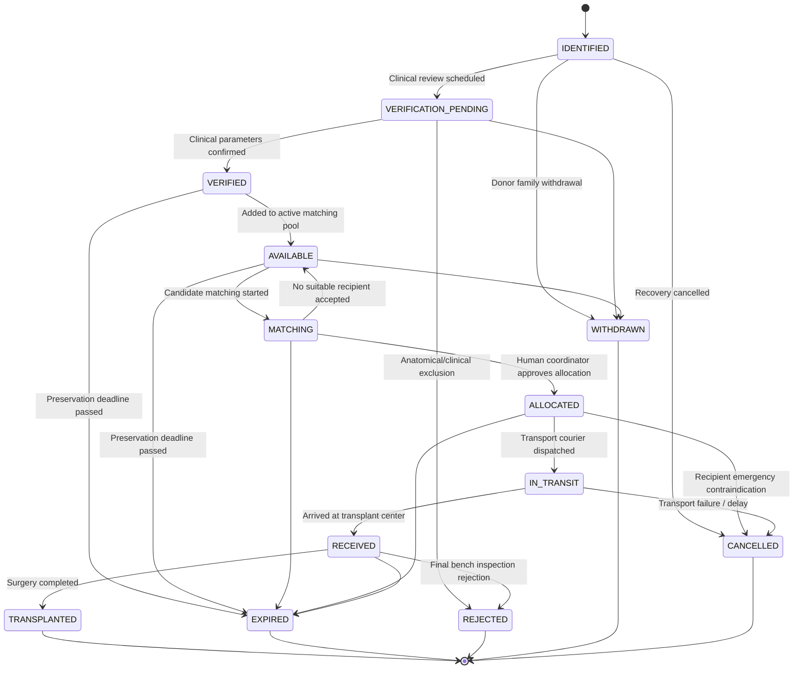
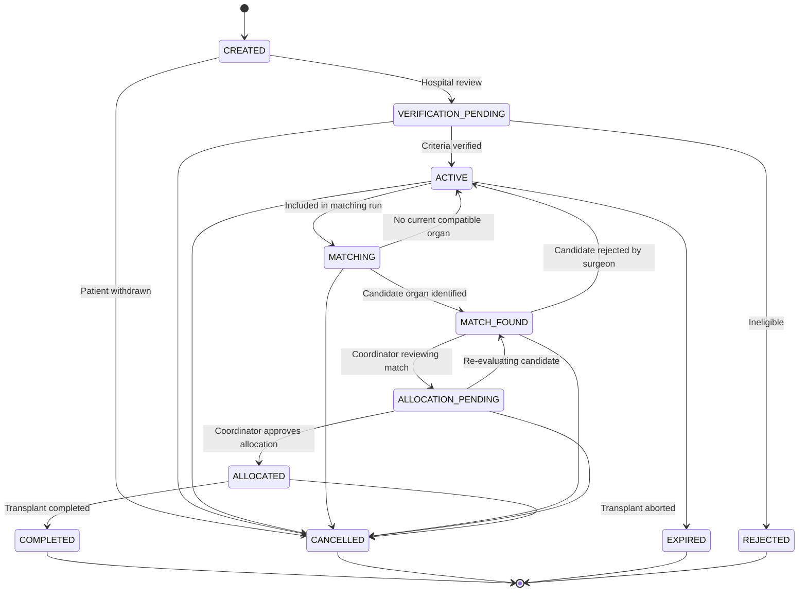
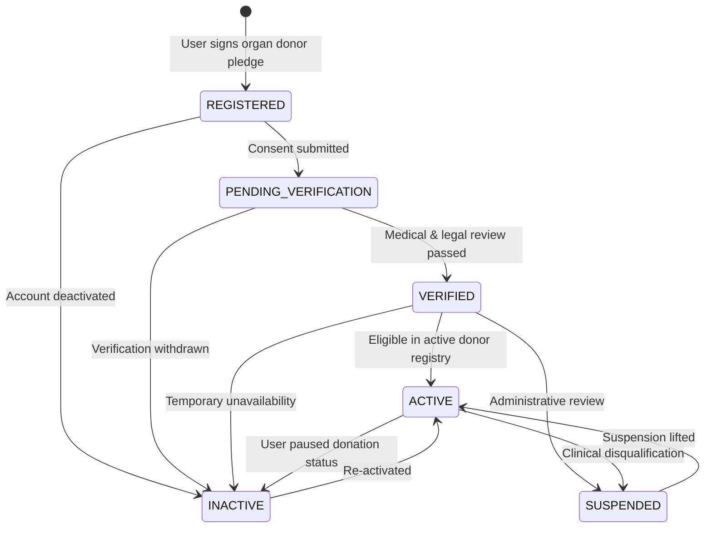
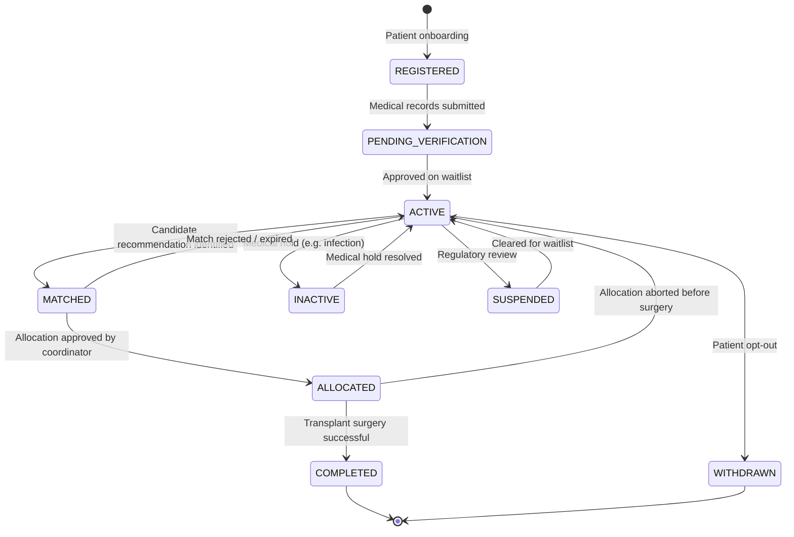
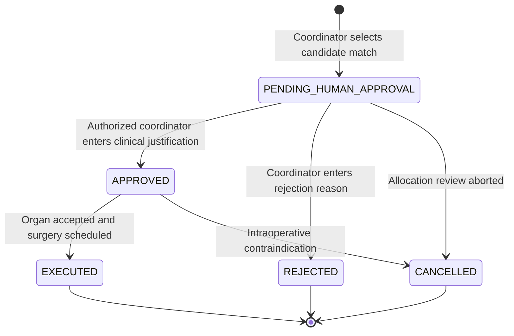

# VeinLink — Domain State Machines & Lifecycle Specifications

All lifecycle state transitions in VeinLink are enforced server-side inside Convex mutations using the lookup validator `isValidTransition()`.

---

## 1. Organ Inventory Lifecycle

Tracks an individual recovered organ from initial identification through transplantation or expiration.

---

## 2. Organ Request Lifecycle

Tracks a transplant candidate's active request across the matching and allocation pipeline.

---

## 3. Organ Donor Lifecycle

Tracks an individual organ donor through registration, clinical verification, and active registry status.

---

## 4. Recipient Lifecycle

Tracks an organ recipient candidate on the active waiting list.

---

## 5. Allocation Governance Lifecycle (Human Decision Boundary)

Illustrates the mandatory human coordinator checkpoint between algorithmic candidate matching and legal organ allocation.

