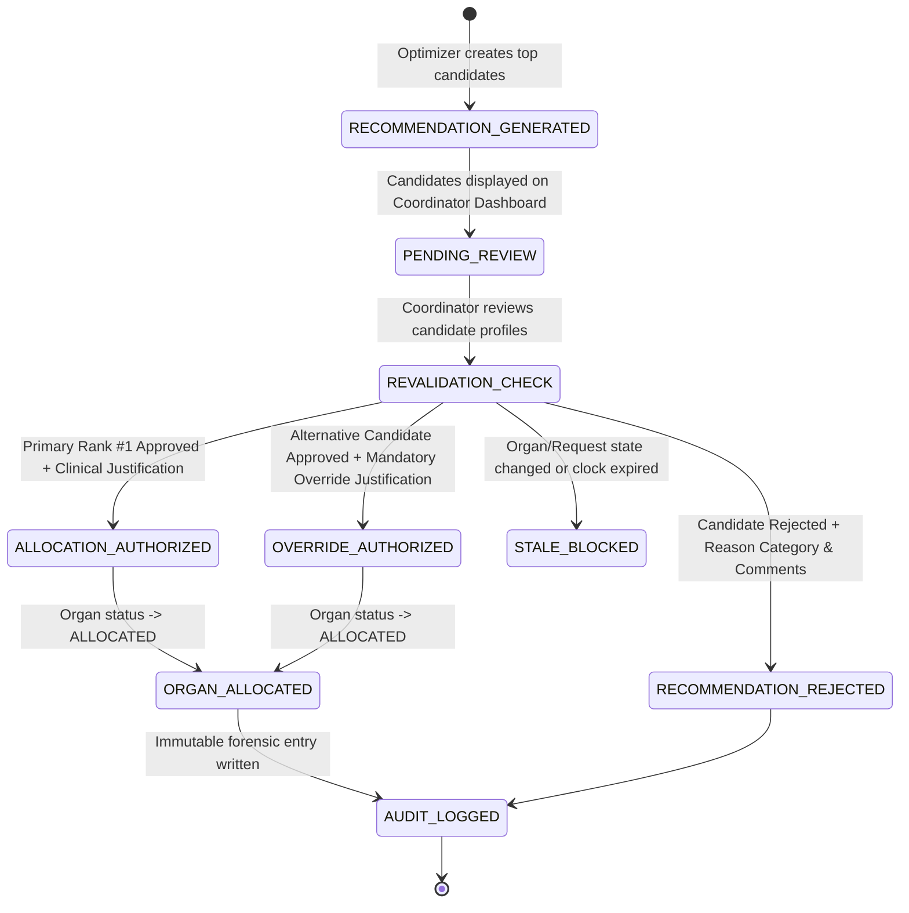

# VeinLink — Human Approval & Allocation Governance Workflow

## 1. Governance Lifecycle Overview

The human approval workflow ensures that organ allocation decisions remain exclusively under clinical authority while benefiting from automated multi-objective decision support:

---

## 2. Reviewer Actions & Requirements

### Action 1: Standard Approval (Primary Rank #1 Candidate)
- **Role Requirement**: Authenticated user with `hospital` or `admin` role.
- **Prerequisites**: Organ in `AVAILABLE` or `MATCHING` status; request in `ACTIVE` status; preservation clock viable.
- **Required Input**: Clinical justification text (e.g. "Primary candidate meeting medical urgency and logistical transit feasibility").
- **Consequences**:
  - Recommendation status $\to$ `APPROVED`.
  - Competing recommendations $\to$ `SUPERSEDED`.
  - `organInventory` $\to$ `ALLOCATED`.
  - `organRequests` $\to$ `ALLOCATED`.
  - `recipients` $\to$ `ALLOCATED`.
  - Authorized allocation entity created in `organAllocations`.

### Action 2: Human Override (Alternative Candidate Selection)
- **Applicability**: Coordinator selects Rank #2 or Rank #3 instead of Rank #1.
- **Mandatory Requirements**:
  - `isOverride: true`
  - `overrideReason: string` (Must provide explicit clinical/operational rationale, e.g. "Operating room availability consensus", "Surgeon assessment of hemodynamic stability").
- **Audit Significance**: The system records the delta between the algorithm's recommendation and the human decision, preserving accountability and supporting future policy refinement.

### Action 3: Rejection
- **Applicability**: Coordinator declines to allocate to candidate.
- **Required Inputs**:
  - Structured category (`Clinical Review Concern`, `Logistics Unfeasible`, `Patient Unavailable`, `Other`).
  - Free-text explanation.
- **Consequences**:
  - Recommendation $\to$ `REJECTED`.
  - If no other candidates are pending review, organ returns to `AVAILABLE` status.

---

## 3. Anti-Stale Revalidation & Concurrency Protection

1. **Pre-Commit Revalidation**: A recommendation generated earlier in the day is not trusted blindly. Before executing approval, the server revalidates current organ status, recipient status, and cold ischemia preservation deadline.
2. **Atomic Concurrency Protection**: If two reviewers attempt to approve allocations for the same organ simultaneously, only the first transaction commits; the second attempt is safely rejected with:
   > *"Allocation Conflict: This allocation is no longer valid because the organ is in status 'ALLOCATED'."*
