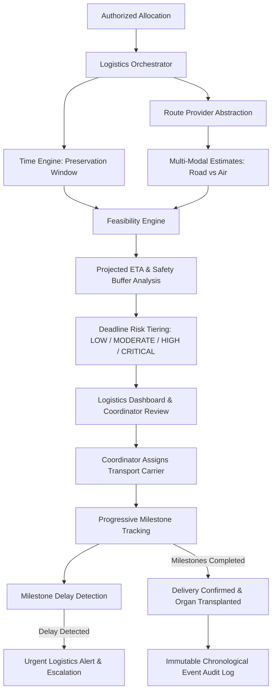

# VeinLink — Time-Critical Organ Logistics & Transport Intelligence Architecture

## 1. System Vision & Governance Boundary

The logistics intelligence layer operates as a **decision-support and timeline-governance engine** answering:

> *"Can this approved organ allocation realistically be transported from the source facility to the destination facility within the available preservation window?"*

### Critical Architectural Boundary
- The logistics layer does **NOT** determine medical eligibility, organ suitability, or clinical priority.
- It uses the authoritative cold ischemia preservation deadline (`organ.preservationDeadline`) established during procurement verification.
- **Anti-Autonomous Reallocation Invariant**: If logistics discovers that a planned transit has become infeasible or severely delayed, the system **never** automatically cancels the allocation or reallocates the organ to another patient. Instead, it generates an urgent logistics alert and escalates to authorized human coordinators for clinical review.

---

## 2. Conceptual Architecture



---

## 3. Modular Domain Components

### 1. Logistics Time Engine (`timeEngine.ts`)
- Continuously calculates remaining cold ischemia time:
  $$\text{Remaining Window} = \text{Preservation Deadline} - \text{Current Time}$$
- Formats countdowns in human-readable notation (e.g. `03h 45m remaining`).
- Evaluates deadline risk tiers based on buffer compression:
  $$\text{Buffer Margin} = \text{Preservation Deadline} - (\text{Estimated Arrival} + \text{Safety Buffer})$$

### 2. Route Provider Abstraction (`routeEngine.ts`)
- Decouples core logistics from specific navigation APIs via the `RouteProvider` interface:
  ```typescript
  export interface RouteProvider {
    name: string;
    calculateRoutes(origin: Coordinates, destination: Coordinates): Promise<RouteEstimate[]>;
  }
  ```
- Evaluates multi-modal transit options:
  - **Ground Ambulance**: Regional routes $\le 350\text{ km}$, 75 km/h average speed, 25 min prep/handoff buffer, 30 min safety buffer.
  - **Air Charter**: Long-range corridors $\ge 60\text{ km}$, 480 km/h flight speed, 50 min runway/apron handoff buffer, 60 min safety buffer.
- Explicitly flags mock/simulated estimates with `isSimulation: true` to prevent false claims of live GPS access.
- Detects stale route estimates older than 30 minutes.

### 3. Feasibility & Delay Engine (`feasibilityEngine.ts`)
- Evaluates options across `FEASIBLE`, `RISKY`, and `INFEASIBLE`.
- Identifies the recommended option (maximizing positive safety margin).
- Detects milestone schedule slippage: compares planned vs actual milestone timestamps. If delay $\ge 15\text{ mins}$, triggers delay events; if delay threatens the remaining preservation window, escalates to `CRITICAL` severity.

### 4. Logistics Orchestrator (`logisticsOrchestrator.ts`)
- Convex service layer handling transactional state changes, coordinator assignments, milestone updates, delay escalations, and event feeds.
