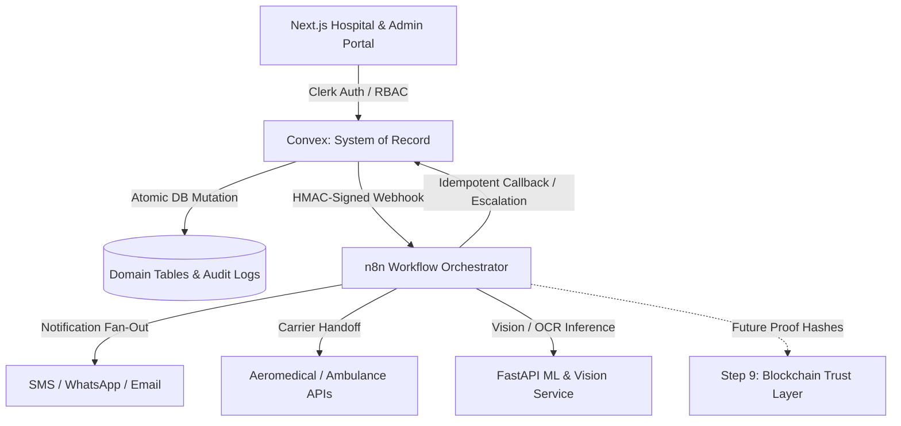

# VeinLink — n8n Event-Driven Architecture & Responsibilities

## 1. Architectural Purpose

VeinLink separates **authoritative healthcare state** from **event-driven workflow automation**:
- **Convex** acts as the transactional **System of Record** containing authoritative clinical invariants, inventory, matching algorithms, allocation approval, and audit logs.
- **n8n** acts as the **Workflow Orchestration & Response Engine**, executing asynchronous operational tasks, multi-channel notifications (SMS/Email/Push), timeout escalations, and external service fan-out.

---

## 2. Strict Responsibility Matrix

| Capability / Concern | Convex Responsibility | n8n Responsibility |
| :--- | :---: | :---: |
| **Authoritative State & Storage** | **Primary Owner** (System of Record) | Read-only consumer / ephemeral cache |
| **Donor & Recipient Medical Eligibility** | **Primary Owner** (Strict Domain Invariant) | Strictly prohibited from altering |
| **Blood & Organ Compatibility Matching**| **Primary Owner** (Policy & Optimization) | Strictly prohibited from deciding |
| **Organ Allocation Approval** | **Primary Owner** (Human Coordinator Gate) | Strictly prohibited from approving |
| **Preservation Clock Tracking** | **Primary Owner** (Cold Ischemia Math) | Escalation notification driver |
| **Multi-Channel Notification Fan-Out** | Event Emitter | **Primary Owner** (SMS / Push / Email) |
| **Timeout & Delay Escalation Chains** | Target Record State | **Primary Owner** (Workflow Timers) |
| **External Logistics Carrier Webhooks** | Dispatch Authorization | **Primary Owner** (3rd-Party Adapters) |
| **Operational Workflow Retries & DLQ** | Event Status Store | **Primary Owner** (Execution Logic) |

---

## 3. Core Safety & Architectural Invariants

1. **Convex Remains System of Record**: Under no circumstance does n8n become the source of truth for medical or operational healthcare records.
2. **Anti-Autonomous Allocation Invariant**: Organ allocation strictly requires an authenticated human coordinator with recorded clinical justification. n8n workflows **never** autonomously approve or execute organ allocations.
3. **Anti-Auto-Modification Invariant**: Probabilistic OCR or external webhook results **never** mutate authoritative clinical database records without authorized human coordinator sign-off.
4. **Idempotent Execution**: Every incoming event has a compound key (`workflowName::eventId`) ensuring that duplicate webhook deliveries cause zero duplicate side-effects (e.g. no repeated emergency SMS alerts).
5. **Fail-Safe Operation**: If n8n or an external notification gateway experiences an outage, Convex continues all clinical operations uninterrupted.
