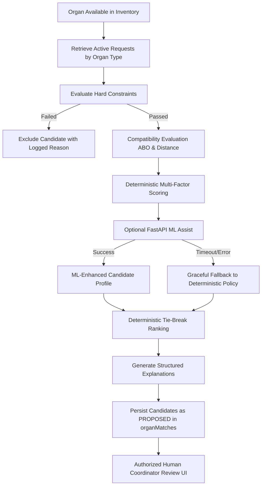

# VeinLink — Organ Matching Architecture Specification

## 1. System Vision & Safety Boundary

The **Organ Compatibility & Matching Engine** in VeinLink is designed strictly as an **explainable decision-support and recommendation system**. 

It answers the question:
> *"Given an available organ and eligible recipient requests, which candidates are potentially suitable according to configured policies and data?"*

It **never** answers:
> *"Who should receive the organ?"*

Organ allocation is a formal, legally authorized clinical decision made by human transplant coordinators (implemented in Step 5). The matching engine only generates candidate recommendations with `status: "PROPOSED"`.

---

## 2. The Matching Pipeline

---

## 3. Separation: Hard Constraints vs Soft Scoring

### Hard Constraints (Binary Pass / Fail)
A candidate must satisfy every hard constraint. If any constraint fails, the candidate is immediately excluded with an auditable failure reason:
1. `ORGAN_TYPE_MATCH`: Requisition organ type strictly matches available organ type (`KIDNEY` === `KIDNEY`).
2. `ORGAN_AVAILABLE`: Organ status is `AVAILABLE` or `MATCHING` (not `ALLOCATED`, `EXPIRED`, `TRANSPLANTED`).
3. `REQUEST_ACTIVE`: Request status is `ACTIVE` or `MATCHING` (not `CANCELLED`, `EXPIRED`, `COMPLETED`).
4. `RECIPIENT_ACTIVE`: Recipient status is `ACTIVE` (not `INACTIVE`, `WITHDRAWN`, `SUSPENDED`).
5. `VERIFICATION_PASSED`: Recipient verification status is `VERIFIED`.
6. `PRESERVATION_TIME_VIABLE`: Preservation deadline has not passed (`deadline > now + minTransitBuffer`).
7. `DISTANCE_THRESHOLD`: Logistical distance does not exceed policy maximum threshold (`1500 km`).

### Soft Scoring Factors (Normalized Multi-Factor Evaluation)
Candidates passing all hard constraints are evaluated across normalized factors ($\in [0.0, 1.0]$):
- **Medical Urgency Factor ($w = 0.35$)**: `CRITICAL: 1.0`, `HIGH: 0.75`, `MEDIUM: 0.50`, `LOW: 0.25`.
- **Waitlist Priority Factor ($w = 0.25$)**: Normalized based on cumulative active days on waitlist.
- **Geographic Feasibility Factor ($w = 0.20$)**: Linear decay curve relative to transport distance.
- **Cold Ischemia Viability Factor ($w = 0.15$)**: Ratio of remaining preservation window to estimated transit time.
- **Data Completeness Factor ($w = 0.05$)**: Ratio of verified clinical and geographic telemetry fields.

---

## 4. Deterministic Explainability

Matches are accompanied by deterministic, structured explanations generated directly from scoring data (not hallucinations):
- **Summary**: Concise high-level verdict.
- **Key Factors (`bullets[]`)**: Itemized score contributions (`✓ Medical Urgency: CRITICAL tier`, `✓ Exact ABO Match: O- to O-`).
- **Warnings (`warnings[]`)**: Actionable clinical and logistical alerts (`⚠ Long transport distance: 420 km`).
- **Factor Breakdown**: Factor-by-factor score contribution dictionary.
- **Data Confidence**: Rating (`HIGH`, `MEDIUM`, `LOW`) based on data completeness.

---

## 5. ML Integration & Resilient Fallback

The matching engine integrates with the external FastAPI microservice:
- **Endpoint**: `POST /predict/organ-compatibility`
- **Payload**: `organ_type`, `donor_blood`, `recipient_blood`, `urgency`, `distance_km`, `remaining_preservation_hours`.
- **Response**: `score`, `confidence`, `model_version`, `features`, `explanation`.
- **Fallback Guarantee**: The Convex action enforces an AbortController timeout (1.2 seconds). If the ML service times out, errors, or fails validation, the system continues seamlessly with the primary deterministic policy score, tagging `modelVersion: "deterministic-fallback"`.

---

## 6. Auditability & Observability

- Every matching evaluation records an immutable entry in `auditLogs` (`ORGAN_MATCHING_EVALUATED`) detailing the organ ID, candidate count, and policy version.
- Operational telemetry is recorded in `aiEvents`, tracking model execution time, candidate count, top scores, and trigger source.
