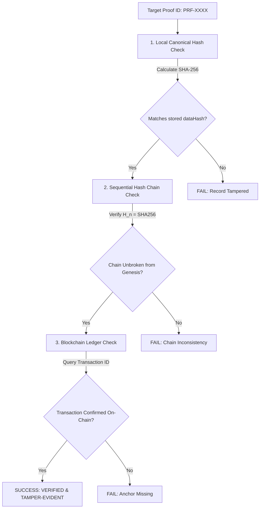

# VeinLink — Independent Cryptographic Proof Verification Guide

This guide describes how an external auditor or healthcare regulator can independently verify the authenticity and integrity of a VeinLink audit record without accessing sensitive Protected Health Information (PHI).

---

## The 3-Point Cryptographic Verification Check

---

## Step-by-Step Verification Procedure

### Point 1: Canonical Data Hash Recalculation
1. Retrieve the canonical event payload associated with `proofId`.
2. Apply the deterministic canonical stringifier (`canonicalStringify(payload)`).
3. Compute `computedHash = SHA-256(canonicalString)`.
4. Verify `computedHash === storedDataHash`.

### Point 2: Hash Chain Continuity
1. Retrieve all audit proofs in sequence up to the target `proofId`.
2. Starting from `GENESIS_HASH`, verify for each record $i$:
   $$\text{chainHash}_i === \text{SHA-256}(\text{dataHash}_i + \text{previousAuditHash}_i)$$
3. Confirm that no intermediate records have been inserted, modified, or deleted.

### Point 3: Blockchain Transaction Verification
1. Inspect the recorded `blockchainTxId` on the target network.
2. Verify that the transaction receipt exists on the blockchain ledger:
   - For single proofs: Confirms `transaction.payloadHash === chainHash`.
   - For batched proofs: Confirms `chainHash` is included in the on-chain `merkleRoot` using the Merkle inclusion proof path.
3. Verify that the confirmed block timestamp precedes or matches the audit milestone.

---

## Interactive Verification via Web Portal

1. Log into the VeinLink Admin Portal as an authorized coordinator or auditor.
2. Navigate to **`/admin/trust`** $\to$ **Proof Verifier**.
3. Enter the `Proof ID` or select any record from the Cryptographic Proofs feed.
4. The system automatically executes the 3-point integrity check and renders real-time verification status badges.
