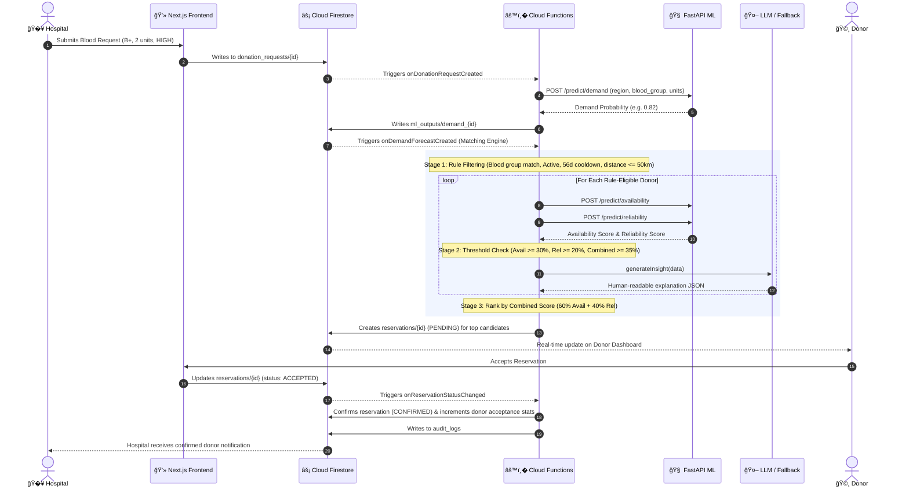

# VeinLink — Intelligent Blood & Organ Donor Network

> **An event-driven, AI-orchestrated healthcare platform bridging hospitals, transplant centers, and donors with real-time matching, predictive shortage forecasting, and explainable AI.**

[](https://nextjs.org/)
[](https://react.dev/)
[](https://www.typescriptlang.org/)
[](https://fastapi.tiangolo.com/)
[](https://convex.dev/)
[](https://clerk.com/)
[](https://www.python.org/)
[](https://tailwindcss.com/)

---

## 📌 Table of Contents

- [Overview & Problem Statement](#-overview--problem-statement)
- [Key Features & Role-Based Portals](#-key-features--role-based-portals)
- [System Architecture](#-system-architecture)
- [End-to-End Workflow](#-end-to-end-workflow)
- [Machine Learning & Explainable AI (XAI)](#-machine-learning--explainable-ai-xai)
- [Tech Stack](#-tech-stack)
- [Repository Index & Structure](#-repository-index--structure)
- [Getting Started & Local Development](#-getting-started--local-development)
  - [Prerequisites](#prerequisites)
  - [1. ML Inference Service Setup (FastAPI)](#1-ml-inference-service-setup-fastapi)
  - [2. Convex Backend Setup](#2-convex-backend-setup)
  - [3. Next.js Web Frontend Setup](#3-nextjs-web-frontend-setup)
  - [4. Verification & Testing](#4-verification--testing)
- [Impact & Healthcare Benefits](#-impact--healthcare-benefits)
- [Scalability & Enterprise Architecture](#-scalability--enterprise-architecture)
- [Security & Regulatory Compliance](#-security--regulatory-compliance)
- [License & Contributing](#-license--contributing)

---

## 🔬 Overview & Problem Statement

Blood and organ donor management is one of healthcare's most time-critical logistics challenges:
- **Unpredictable Shortages:** Blood banks and surgical centers experience localized stockouts of rare or critical blood groups (e.g., O-, AB-) during emergencies.
- **Donor Fatigue & Low Response:** Generic broadcast donor calls cause notification fatigue, leading to high no-show rates.
- **Manual, Slow Coordination:** Hospitals rely on phone calls and static lists, losing precious minutes during critical traumas or transplants.
- **Opaque Decision Making:** Algorithmic matching often lacks transparency, leaving medical coordinators unable to verify why a donor was prioritized.

**VeinLink** solves this with an **event-driven, AI-orchestrated architecture**. Powered by **Convex reactive data streams**, **Clerk authentication**, and a **FastAPI predictive intelligence service**, VeinLink automates donor ranking, predicts supply deficits before they occur, and maintains an immutable audit trail for healthcare governance.

---

## 👥 Key Features & Role-Based Portals

### 1. 🩸 Donor Portal (`/donor`)
- **Personalized Bento Dashboard:** View blood type, active availability status, verified eligibility status, and lifetime impact metric (*3 lives saved per donation*).
- **Intelligent Request Radar:** Receive real-time matched requests with estimated driving distance, hospital details, and urgency level.
- **Explainable Match Insights:** Understand *why* you were chosen (e.g., proximity, optimal recovery duration, past reliability).
- **Safety & Cooldown Guards:** Automated 56-day mandatory recovery enforcement to ensure donor health.
- **Hospital Navigation:** Integrated Leaflet map with interactive hospital location markers, routing distance, and directions.
- **Availability Schedule & History:** Set recurring availability windows, manage past donation records, and download donation summaries.

### 2. � Hospital & Blood Bank Portal (`/hospital`)
- **Live Inventory Monitor:** Real-time stock visibility across all 8 blood groups (`A+`, `A-`, `B+`, `B-`, `AB+`, `AB-`, `O+`, `O-`) with unit counts and deficit alerts.
- **Smart Donation Request Dispatcher:** Create targeted requests with customized urgency tiers:
  - `LOW` (Planned surgeries, standard inventory refill — 100km radius)
  - `MEDIUM` (Scheduled major procedures — 75km radius)
  - `HIGH` (Active emergency admissions — 50km radius)
  - `CRITICAL` (Mass casualty / severe trauma — 100km emergency radius + auto-alerts)
- **Donor Activation & Candidate Ranking:** Real-time display of scored candidate matches (Combined Score = 60% Availability + 40% Reliability).
- **Patient & Checkup Management:** Schedule pre-donation screenings, hemoglobin checks, and verify donor clinical eligibility.

### 3. 🛡� System Administration & AI Observability (`/admin`)
- **Real-Time AI System Monitor (`/admin/ai-monitor`):**
  - Live stream of all AI/ML inference events (`demand_forecasting`, `donor_availability`, `donor_reliability`).
  - Observability into inference latency (ms), confidence scores, model versions, input vectors, and outputs.
  - Failure detection and fallback trigger auditing.
- **Immutable Audit Logging (`/admin/audit-logs`):**
  - Complete tamper-evident record of all system events (`REQUEST_CREATED`, `RESERVATION_ACCEPTED`, `RESERVATION_CONFIRMED`, `INVENTORY_CHANGED`).
  - Tracks user ID, user email, IP address, timestamp, resource ID, and execution status (`SUCCESS` / `FAILURE` / `ERROR`).
- **Entity Management:** Directory of all registered donors, verification states, hospital accreditations, an## �� System Architecture

VeinLink adheres to strict architectural isolation principles:

```text
                         ┌──────────────────────�
                         │      Next.js         │
                         │   Role-based UI      │
                         └──────────┬───────────┘
                                    │
                                    â–¼
                         ┌──────────────────────�
                         │ Clerk Authentication │
                         └──────────┬───────────┘
                                    │
                                    â–¼
                         ┌──────────────────────�
                         │       Convex         │
                         │ System of Record     │
                         │ Domain + Policies    │
                         └─────┬─────────┬──────┘
                               │         │
                     Domain    │         │ Intelligence
                     Events    │         │ Requests
                               â–¼         â–¼
                        ┌──────────�  ┌──────────�
                 ### Core Architectural Invariants:
1. **Convex as System of Record:** Convex holds authoritative state for all blood inventory, organ viability, waitlist priorities, and audit logs.
2. **Strict Human Gate:** Sensitive medical operations (organ allocation, medical eligibility overrides) require authenticated human coordinator approval.
3. **Decoupled AI & CV Inference:** If the ML backend experiences latency or downtime, deterministic fallback engines take over without blocking healthcare workflows.
4. **Idempotent Automation:** n8n processes domain events with unique idempotency keys, preventing duplicate emergency alerts.
5. **Complete Auditability:** Every domain event, workflow escalation, and human decision is immutably persisted in `auditLogs` and `domainEvents`.

---”€â”€â”€â”€â”€â”€â”€â”€â”€â”€â”€â”€â”€â”€â”€â”€â”€â”€â”˜
```

### Core Architectural Invariants:
1. **Zero Direct Frontend-to-ML Access:** The Next.js frontend is prohibited from directly communicating with the ML inference API. All ML decisions flow through serverless Firebase Cloud Functions triggered by database state changes.
2. **Firestore as the Single Source of Truth:** All workflow transitions are executed via Firestore document modifications and atomic transactions.
3. **Decoupled AI Inference:** If the ML backend experiences network latency or downtime, default heuristics and deterministic fallback engines take over, preventing critical clinical workflow blockages.
4. **Complete Explainability & Auditability:** Every model input, output, confidence score, and subsequent action is persisted into `ml_outputs`, `ai_events`, and `audit_logs`.

---

## 🔄 End-to-End Workflow



---

## 🧠 Machine Learning & Explainable AI (XAI)

### 1. The ML Microservice Models (`ml-backend`)

| Model | File / Algorithm | Input Parameters | Output & Purpose |
|---|---|---|---|
| **Demand Forecasting** | `demand_forecasting_model.joblib` (Random Forest / Gradient Boosting Classifier) | `region` (int), `blood_group` (0-7), `demand_units` (int), `supply_units` (int), `month` (1-12), `day` (1-31) | `predicted_demand` (float 0.0–1.0). Forecasts surge probability and triggers regional shortage alerts. |
| **Donor Reliability** | `donor_reliability_model.joblib` (Supervised Regressor / Classifier) | `total_requests`, `accepted_requests`, `completed_donations`, `no_shows`, `avg_response_time_minutes` | `reliability_score` (float 0.0–1.0). Quantifies donor consistency and commitment over time. |
| **Donor Availability** | `donor_availability_model.joblib` (Calibrated Classifier) | `distance_km`, `time_of_day` (0-3), `urgency_level` (0-3), `days_since_last_donation`, `past_acceptance_rate` | `availability_probability` (float 0.0–1.0). Predicts likelihood of donor responding favorably right now. |

### 2. Multi-Stage Scoring Formula
```math
\text{Combined Score} = (0.60 \times \text{Availability Probability}) + (0.40 \times \text{Reliability Score})
```
- **Rule Filters:** Must be active, blood group matched, ≥ 56 days since last donation, distance ≤ radius limit (`LOW`: 100km, `MEDIUM`: 75km, `HIGH`: 50km, `CRITICAL`: 100km).
- **ML Minimum Thresholds:** Availability ≥ 0.30, Reliability ≥ 0.20, Combined Score ≥ 0.35.

### 3. Explainable AI (XAI) Architecture
Rather than presenting clinicians with an ungrounded black-box percentage, VeinLink routes model features into an LLM synthesis engine:
- **Strict Guardrail:** LLM is **never** used to predict clinical suitability or generate medical recommendations. It only ingests deterministic ML scores and contextual metadata.
- **Providers Supported:** OpenAI (`gpt-4o-mini`), Anthropic (`claude-3-haiku`), Hugging Face Inference API (`google/gemma-7b-it`), Local Ollama (`llama3` / `mistral`).
- **Deterministic Rule Fallback:** Built-in rule engine produces structured insights if external LLM APIs are unreachable, ensuring 100% system uptime.
- **Contract Schema (`contracts/llm_contract.ts`):**
```typescript
export interface AIInsight {
  source: "llm" | "fallback";
  title: string;
  summary: string;
  bullets: string[];
  confidence: "LOW" | "MEDIUM" | "HIGH";
}
```

---

## 🛠� Tech Stack

### Web Frontend
- **Framework:** [Next.js 16](https://nextjs.org/) (App Router, Server Components & Client Hooks)
- **Language & Runtime:** React 19, TypeScript 5, Node.js 20+
- **Styling & UI:** Tailwind CSS v4, Radix UI Primitives, Lucide Icons, Tabler Icons, Class Variance Authority (CVA)
- **Animation & Visuals:** GSAP 3.13, Motion (Framer Motion v12), OGL WebGL library
- **Mapping & Geolocation:** Leaflet 1.9, React-Leaflet, Google Maps API types
- **State & Notifications:** Firebase Client SDK v11, Sonner toasts

### Cloud Orchestration & Backend
- **Platform:** Firebase Cloud Functions v2 (Google Cloud Functions / Cloud Run infrastructure)
- **Runtime:** Node.js 24 (TypeScript 5.7)
- **Database:** Google Cloud Firestore (Real-time WebSocket sync, ACID transactions, structured queries)
- **Security:** Firestore Declarative Security Rules (`firestore.rules`) with role-based validation

### Machine Learning Backend
- **Framework:** FastAPI, Uvicorn (ASGI)
- **Language:** Python 3.8+
- **Data & Modeling:** Scikit-learn, Pandas, NumPy, Joblib, Pydantic v2
- **Validation:** Automated unit & integration tests (`tests/`)

---

## � Repository Index & Structure

```
blood-organ-donor-network/
├── contracts/                        # Shared TypeScript Contracts & Schemas
│   └── llm_contract.ts               # Type definitions for LLM inputs and structured insights
│
├── docs/                             # Engineering Specs, Guides & Architecture Docs
│   ├── ARCHITECTURE_SUMMARY.md       # High-level architecture summary and principles
│   ├── end_to_end_flow.md            # Detailed timeline of lifecycle events
│   ├── ml_contract.md                # ML API endpoints, payload schemas, and encoding rules
│   └── TESTING_GUIDE.md              # Comprehensive manual and automated testing scenarios
│
├── ml-backend/                       # Python FastAPI Machine Learning Inference Microservice
│   ├── ml_inference/
│   │   ├── api/
│   │   │   ├── main.py               # FastAPI entrypoint (/health, /predict/*)
│   │   │   └── schemas.py            # Pydantic request/response validation schemas
│   │   ├── models/                   # Serialized ML model binaries (.joblib)
│   │   │   ├── demand_forecasting_model.joblib
│   │   │   ├── donor_availability_model.joblib
│   │   │   └── donor_reliability_model.joblib
│   │   ├── availability.py           # Availability inference logic & preprocessor
│   │   ├── demand.py                 # Demand prediction & encoding logic
│   │   ├── reliability.py            # Reliability score scoring logic
│   │   ├── data_logger.py            # Inference logging utility
│   │   ├── loader.py                 # Thread-safe model cache loader
│   │   └── tests/                    # Unit tests for ML endpoints
│   ├── requirements.txt              # Python package dependencies
│   └── README.md                     # ML service specific documentation
│
├── public/                           # Static assets, branding, and images
│
├── web/                              # Next.js 16 React Web Application
│   ├── convex/                       # Convex Realtime Backend Layer
│   │   ├── schema.ts                 # Type-safe database schema (12 tables)
│   │   ├── auth.config.ts            # Clerk JWT issuer integration
│   │   ├── authHelpers.ts            # RBAC and session identity resolvers
│   │   ├── users.ts                  # User profile and role management
│   │   ├── donors.ts                 # Donor registry, eligibility, availability
│   │   ├── hospitals.ts              # Hospital accreditation and profile management
│   │   ├── requests.ts               # Donation request dispatch & state transitions
│   │   ├── reservations.ts           # ACID Match reservation state machine
│   │   ├── matching.ts               # Action orchestrator calling FastAPI ML models
│   │   ├── inventory.ts              # Blood inventory tracking with auto-shortage alerts
│   │   ├── alerts.ts                 # Emergency shortage broadcasts
│   │   ├── audit.ts                  # Tamper-evident forensic audit logs
│   │   ├── aiEvents.ts               # AI model observability stream
│   │   ├── patients.ts               # Hospital patient registry
│   │   ├── checkups.ts               # Walk-in pre-donation screening workflow
│   │   └── crons.ts                  # Scheduled background jobs (e.g., reservation cleanup)
│   ├── scripts/                      # Verification and migration test suites
│   │   └── verify-migration.ts       # Automated integrity & invariant test suite
│   ├── src/
│   │   ├── app/
│   │   │   ├── admin/                # Admin portal: AI Monitor, Audit Logs, Users, Hospitals
│   │   │   ├── donor/                # Donor portal: Dashboard, Requests, Map, History, Schedule
│   │   │   ├── hospital/             # Hospital portal: Dashboard, Requests, Checkups, Alerts
│   │   │   └── login/ & register/    # Clerk role-based authentication flows
│   │   ├── components/               # UI component library (Bento grids, Leaflet map, dialogs)
│   │   ├── hooks/                    # Convex reactive custom hooks (useReservations, etc.)
│   │   ├── middleware.ts             # Clerk Edge Route Protection
│   │   └── lib/                      # Utilities and clinical constants
│   ├── package.json                  # Web dependencies (Convex + Clerk + Tailwind v4)
│   └── next.config.ts                # Next.js configuration
│
└── README.md                         # Main repository documentation (this file)
```

---

## 🚀 Getting Started & Local Development

### Prerequisites
- **Node.js**: v20.x or v22.x+
- **Package Manager**: `pnpm` (recommended) or `npm`
- **Python**: 3.8+ (with `pip` or `venv`)

---

### 1. ML Inference Service Setup (FastAPI)
In a dedicated terminal window:
```bash
cd ml-backend

# Create and activate virtual environment
python -m venv venv
# Windows:
.\venv\Scripts\activate
# Unix/MacOS:
# source venv/bin/activate

# Install requirements
pip install -r requirements.txt

# Start FastAPI server on port 8000
uvicorn ml_inference.api.main:app --reload --host 127.0.0.1 --port 8000
```
*Verify ML health check: `curl http://127.0.0.1:8000/health`*  
*Interactive Swagger Documentation: `http://127.0.0.1:8000/docs`*

---

### 2. Convex Backend Setup
In a second terminal window:
```bash
cd web

# Start Convex local development sync (syncs schema and functions to your cloud project)
npx convex dev
```

---

### 3. Next.js Web Frontend Setup
In a third terminal window:
```bash
cd web

# Install dependencies
pnpm install

# Set up environment variables
cp env.example .env.local
```

Configure `web/.env.local`:
```env
NEXT_PUBLIC_CONVEX_URL=https://your-deployment.convex.cloud
NEXT_PUBLIC_CLERK_PUBLISHABLE_KEY=pk_test_...
CLERK_SECRET_KEY=sk_test_...
NEXT_PUBLIC_ML_API_URL=http://localhost:8000
```

Start the Next.js development server:
```bash
pnpm dev
```
*Open [http://localhost:3000](http://localhost:3000) in your browser.*

---

### 4. Verification & Testing
Run the automated migration verification suite to validate invariants, compatibility matrices, and schema models:

```bash
cd web
pnpm verify:migration
```
*(Confirms 17/17 invariant tests pass).*

# Seed inventory conditions that trigger automated shortage alerts
pnpm seed:shortage

# Verify end-to-end backend and ML connectivity
npx tsx scripts/verify-backend.ts
```

---

## 📈 Impact & Healthcare Benefits

```
┌───────────────────────────────────────�   ┌───────────────────────────────────────�
│         BEFORE VEINLINK               │   │          WITH VEINLINK                │
├───────────────────────────────────────┤   ├───────────────────────────────────────┤
│ • Broadcast SMS blast to thousands    │   │ • Targeted AI match to top 5-10       │
│ • >60% no-show & fatigue rate         │   │   highly-reliable, available donors   │
│ • Reactive response after stockout    │   │ • Proactive prediction 7-14 days      │
│ • Manual phone coordination (3-5 hrs) │   │   before blood inventory runs dry     │
│ • Black-box / non-auditable choices   │   │ • Sub-minute automated matching       │
│                                       │   │ • Explainable AI & full audit trail   │
└───────────────────────────────────────┘   └───────────────────────────────────────┘
```

1. **Decreased Critical Response Time:** Compresses donor identification and outreach from hours of manual phone calling down to seconds.
2. **Proactive Stockout Prevention:** Predicts demand spikes by region and blood group, enabling hospitals to initiate donor campaigns before reaching critical deficit.
3. **Optimized Donor Retention:** Protects donors from outreach burnout by factoring in mandatory 56-day intervals and availability scores, driving up commitment rates.
4. **Clinical Decision Support:** Hospital blood bank administrators receive explainable bullets indicating distance, reliability history, and availability probability, giving them confidence in every match.

---

## � Scalability & Enterprise Architecture

VeinLink was purposefully engineered to scale from a single municipal hospital network to a nationwide blood and organ distribution infrastructure:

1. **Independent Microservice Scaling:**
   - The ML backend is stateless and can be containerized with Docker and deployed to **Google Cloud Run** or **Kubernetes (GKE)** with Horizontal Pod Autoscaling (HPA) based on request volume.
   - Convex auto-scales on serverless infrastructure, managing database storage, reactive queries, and transactional mutations with persistent WebSocket subscriptions.
2. **High-Performance Reactive Database Layer:**
   - Convex provides ACID transactions and automatic cache invalidation.
   - Queries are indexed with composite keys (`bloodType`, `isActive`, `lastDonationDate`), ensuring $O(\log N)$ or $O(1)$ query complexity.
3. **Resilience & Graceful Degradation:**
   - Circuit-breaker design: If the FastAPI ML service is unreachable or encounters a timeout, Convex Actions smoothly fallback to standard geographical proximity and rule-based prioritization.
   - If external LLM APIs experience outages, the deterministic fallback engine renders pre-compiled clinical explanations without disrupting user flows.
4. **Edge Delivery & Next.js Caching:**
   - Fast initial page loads via Next.js with Clerk Edge authentication middleware, and live real-time WebSocket subscriptions established via `ConvexProviderWithClerk`.

---

## 🔒 Security & Regulatory Compliance

- **Role-Based Access Control (RBAC):** Governed via Clerk JWT sessions verified securely inside Convex backend queries and mutations (`authHelpers.ts`). Donors cannot read other donors' medical records or tamper with reservation rankings; hospitals can only manage requests originating from their institution.
- **Audit Logging:** Every critical modification (status change, request creation, reservation response) is written to an append-only `auditLogs` table with actor metadata, IP address, and timestamps.
- **Privacy First:** Personally identifiable health information (PII/PHI) is strictly compartmentalized. ML inference operates on anonymized numeric feature vectors (distance, response minutes, donation counts) without exposing names or contact info to model providers.
- **Explainability Standards (AI Act & FDA Guidance Alignment):** The platform explicitly prevents generative AI from rendering autonomous clinical diagnoses or uncontrolled predictions, restricting LLM functionality purely to contextual interpretation of validated ML outputs.

---

## 📄 License & Contributing

Distributed under the **MIT License**. See `LICENSE` for details.

### Contributing
1. Fork the repository
2. Create your feature branch (`git checkout -b feature/smart-scheduling`)
3. Commit your changes (`git commit -m 'feat: add smart scheduling algorithm'`)
4. Push to the branch (`git push origin feature/smart-scheduling`)
5. Open a Pull Request
