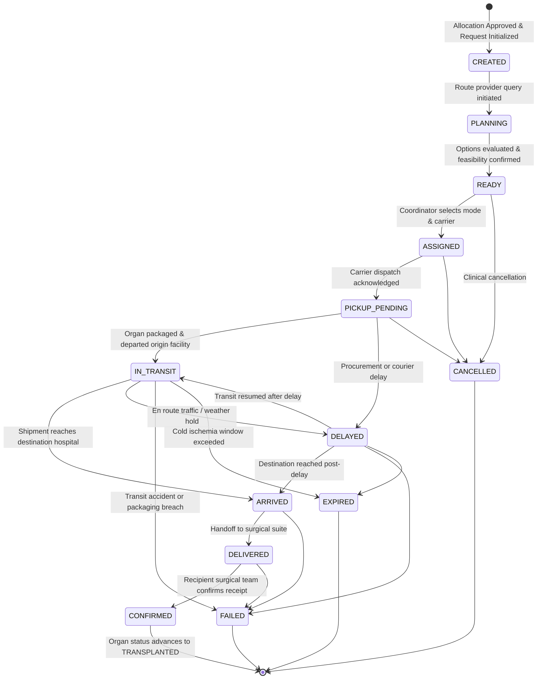

# VeinLink — Organ Transport State Machine Specification

## 1. Lifecycle State Machine Diagram

---

## 2. Controlled Transition Rules

| Current Status | Permitted Target Statuses | Guard Conditions & Side Effects |
| :--- | :--- | :--- |
| `CREATED` | `PLANNING`, `CANCELLED` | Initialized automatically upon allocation authorization. |
| `PLANNING` | `READY`, `CANCELLED` | Route provider completes multi-modal estimates. |
| `READY` | `ASSIGNED`, `CANCELLED` | Authorized coordinator selects transport mode and inputs carrier name. |
| `ASSIGNED` | `PICKUP_PENDING`, `CANCELLED` | Carrier acknowledges dispatch and arrives at donor facility. |
| `PICKUP_PENDING` | `IN_TRANSIT`, `DELAYED`, `CANCELLED` | Custody transfer complete; organ en route. |
| `IN_TRANSIT` | `ARRIVED`, `DELAYED`, `FAILED`, `EXPIRED` | Carrier in transit corridor; continuous deadline monitoring active. |
| `DELAYED` | `IN_TRANSIT`, `ARRIVED`, `FAILED`, `EXPIRED` | Requires recorded delay minutes and operational reason; may trigger critical alert. |
| `ARRIVED` | `DELIVERED`, `FAILED` | Shipment arrives at destination transplant facility arrival bay. |
| `DELIVERED` | `CONFIRMED`, `FAILED` | Physical handoff to transplant surgical team. |
| `CONFIRMED` | *(Terminal)* | Irreversible; updates `organInventory.status` to `TRANSPLANTED`. |
| `CANCELLED` | *(Terminal)* | Halted by clinical coordinator. |
| `FAILED` | *(Terminal)* | Logistical failure recorded. |
| `EXPIRED` | *(Terminal)* | Cold ischemia deadline breached. |

---

## 3. Invalid Transition Protections

Server-side mutations validate state transitions using `isValidTransportTransition()`.
The following sequences are strictly blocked:
1. **Premature Delivery**: `CREATED` or `ASSIGNED` $\to$ `DELIVERED` (rejected without verified pickup and departure).
2. **Post-Terminal Reopening**: `CONFIRMED` $\to$ any status (terminal states cannot be reopened).
3. **Ghost In-Transit**: `READY` $\to$ `IN_TRANSIT` (must be assigned to a verified carrier first).
