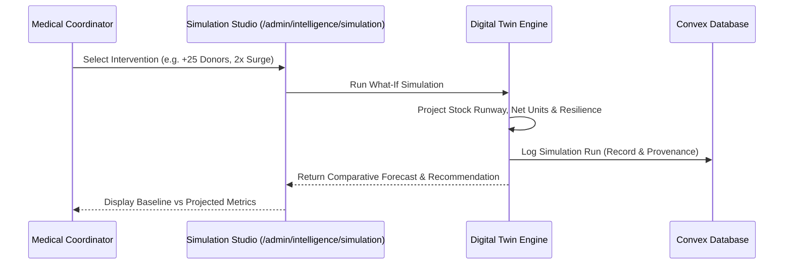

# VeinLink — Digital Twin Healthcare Simulation Studio

## 1. Digital Twin Architecture

The Digital Twin maintains an in-memory synthetic sandbox reflecting real-time facility inventory, regional consumption velocity, and active donor pools. Hospital coordinators can simulate high-impact interventions without dispatching live outreach or modifying patient data.

---

## 2. Supported Scenarios
1. **Targeted Donor Mobilization**: Simulates notifying $N$ candidates with empirical acceptance yield (~38%) to estimate runway extension in hours.
2. **Inter-Hospital Unit Transfer**: Simulates rebalancing $M$ units from surplus facility to deficit facility.
3. **Emergency Trauma Shock**: Simulates $1.5\times - 5.0\times$ mass casualty surges to compute remaining runway before stockout.
