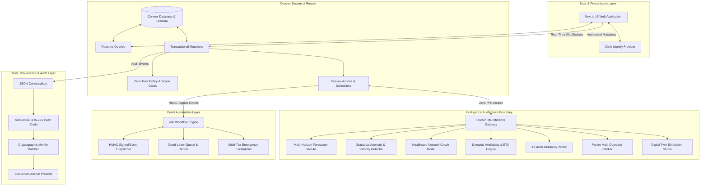

# VeinLink — Final Authoritative System Architecture

```text
================================================================================
VEINLINK: INTELLIGENT BLOOD & ORGAN RESOURCE NETWORK
Status: ARCHITECTURE FROZEN (STEP 12)
Authoritative Architecture Specification
================================================================================
```

## 1. System Overview & Technology Stack

VeinLink is an AI-assisted, privacy-preserving, auditable healthcare resource coordination network designed to predict localized shortages, model healthcare supply topologies, optimize matching and logistics, automate response workflows, and enforce human-governed decision provenance.

```text
Frontend:
Next.js 15 (App Router) + TypeScript + Tailwind CSS + shadcn/ui

Authentication & Identity:
Clerk (Cryptographic JWT session validation + Role metadata)

Primary System of Record & Reactive State:
Convex (Real-time reactive database, transactional mutations, actions, schedulers)

AI / ML Inference Boundary:
FastAPI + Python ML services (scikit-learn, statistical processes, CV/OCR)

Event-Driven Workflow Automation:
n8n (HMAC-signed Webhook orchestration, multi-tier escalation, dead-letter queues)

Trust & Provenance Layer:
Cryptographic SHA-256 Hash Chain + Merkle Tree Batching + Blockchain Proofs

Physical Verification Intelligence:
Computer Vision (CV) + OCR Inspection Pipeline
```

---

## 2. Complete End-to-End Architectural Hierarchy



---

## 3. Strict Architectural Invariants

1. **Clinical Protocols as Authoritative Source of Truth**:
   - Medical eligibility, ABO/Rh compatibility, and cold ischemia thresholds remain hard constraints in Convex code. AI models cannot override or alter clinical rules.
2. **Decision Support vs. Autonomous Authority**:
   - AI models strictly generate advisory predictions, risk signals, and trade-off rankings.
   - Final organ allocation and clinical eligibility decisions require authenticated human coordinator review with recorded justifications for overrides.
3. **Zero-PHI Boundary**:
   - No donor/patient names, phone numbers, email addresses, or exact GPS coordinates may reach ML models, LLM prompts, external webhooks, or on-chain transaction payloads.
4. **Zero-Block Guarantee**:
   - Healthcare transactions execute with zero blockchain latency. Convex transactions commit immediately; cryptographic Merkle roots are anchored asynchronously in batches.
5. **Convex as Sole System of Record**:
   - External services (FastAPI, n8n, Blockchain) are stateless computation or trust engines. State mutations are strictly executed within Convex transactional mutations.
6. **56-Day Cooldown Invariant**:
   - Donors with recent whole blood donations (<56 days) are strictly blocked from blood donation eligibility across all queries and matching engines.
