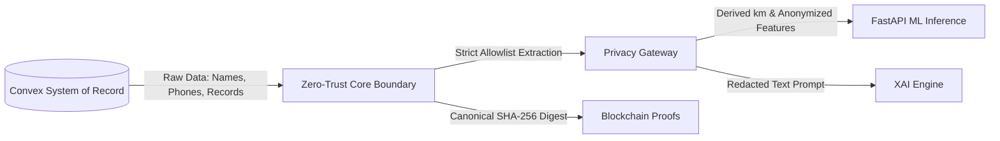

# VeinLink — Healthcare Privacy Architecture & Data Minimization

## 1. Privacy by Design Principles

VeinLink implements strict technical boundaries to isolate Protected Health Information (PHI) from downstream algorithmic engines, public communication channels, and blockchain ledgers.

---

## 2. PII Boundary Enforcement

1. **Zero-PHI to Machine Learning**:
   - The ML matching and demand prediction pipelines receive exclusively anonymized numeric feature vectors (`buildMLFeatures`).
   - Fields such as `donorName`, `phone`, `email`, `address`, and National IDs are stripped before network transmission.

2. **LLM Context Redaction**:
   - The Explainable AI (XAI) gateway sanitizes clinical context with regular expression filters (`filterLLMContext`), replacing emails with `[REDACTED_EMAIL]`, phone numbers with `[REDACTED_PHONE]`, and GPS coordinates with `[REDACTED_COORDINATES]`.

3. **Location Privacy & Tokenization**:
   - Donors' exact residential coordinates are never exposed to hospitals or public queries.
   - The matching engine computes the Haversine distance (`distanceKm`) between donor and hospital coordinates on the server, exposing only coarse operational distances.
