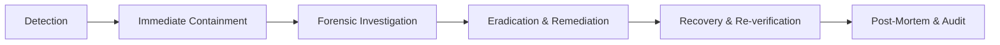

# VeinLink — Security Incident Response & Crisis Management Runbook

## 1. Incident Severity Classification

- **SEV-1 (Critical)**: Active breach of Protected Health Information (PHI), unauthorized alteration of allocation records, or compromised production signing keys.
- **SEV-2 (High)**: Repeated privilege escalation attempts, mass unauthenticated API abuse, or cross-facility isolation failure.
- **SEV-3 (Medium)**: Localized rate-limiting breach, suspicious login frequency, or individual account suspension event.
- **SEV-4 (Low)**: Minor policy violation, single unauthenticated probe, or transient webhook delivery retry.

---

## 2. Response Lifecycle

1. **Detection**: Monitored via `/admin/security` metrics, `securityEvents` stream, and Clerk anomaly detection.
2. **Immediate Containment**:
   - Administrative account lockout via `suspendAccount`.
   - Secret key revocation for compromised integration webhooks.
   - Immediate termination of compromised Clerk active sessions.
3. **Forensic Investigation**:
   - Inspect `auditLogs` and `domainEvents` for the affected correlation ID.
   - Cross-check with local SHA-256 hash chains to verify whether database tampering occurred.
4. **Eradication**:
   - Rotate affected credentials (`CLERK_SECRET_KEY`, `N8N_WEBHOOK_SECRET`, `BLOCKCHAIN_PRIVATE_KEY`).
5. **Recovery**:
   - Restore legitimate accounts via `restoreAccount`.
   - Re-verify ledger integrity via `/admin/trust`.
